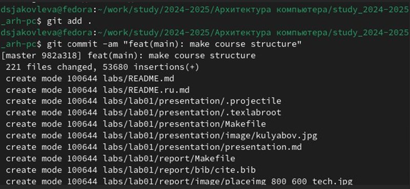

---
## Front matter
title: "Лабораторная работа №2"
subtitle: "Система контроля версий Git"
author: "Яковлева Дарья Сергеевна"

## Generic otions
lang: ru-RU
toc-title: "Содержание"

## Bibliography
bibliography: bib/cite.bib
csl: pandoc/csl/gost-r-7-0-5-2008-numeric.csl

## Pdf output format
toc: true # Table of contents
toc-depth: 2
lof: true # List of figures
lot: true # List of tables
fontsize: 12pt
linestretch: 1.5
papersize: a4
documentclass: scrreprt
## I18n polyglossia
polyglossia-lang:
  name: russian
  options:
	- spelling=modern
	- babelshorthands=true
polyglossia-otherlangs:
  name: english
## I18n babel
babel-lang: russian
babel-otherlangs: english
## Fonts
mainfont: IBM Plex Serif
romanfont: IBM Plex Serif
sansfont: IBM Plex Sans
monofont: IBM Plex Mono
mathfont: STIX Two Math
mainfontoptions: Ligatures=Common,Ligatures=TeX,Scale=0.94
romanfontoptions: Ligatures=Common,Ligatures=TeX,Scale=0.94
sansfontoptions: Ligatures=Common,Ligatures=TeX,Scale=MatchLowercase,Scale=0.94
monofontoptions: Scale=MatchLowercase,Scale=0.94,FakeStretch=0.9
mathfontoptions:
## Biblatex
biblatex: true
biblio-style: "gost-numeric"
biblatexoptions:
  - parentracker=true
  - backend=biber
  - hyperref=auto
  - language=auto
  - autolang=other*
  - citestyle=gost-numeric
## Pandoc-crossref LaTeX customization
figureTitle: "Рис."
tableTitle: "Таблица"
listingTitle: "Листинг"
lofTitle: "Список иллюстраций"
lotTitle: "Список таблиц"
lolTitle: "Листинги"
## Misc options
indent: true
header-includes:
  - \usepackage{indentfirst}
  - \usepackage{float} # keep figures where there are in the text
  - \floatplacement{figure}{H} # keep figures where there are in the text
---

# Цель работы

Целью работы является изучить идеологию и применение средств контроля версий. Приобрести практические навыки по работе с системой git.

# Выполнение лабораторной работы

Сначала сделаем предварительную конфигурацию git. Откроем терминал и введём следующие команды, указав имя и email владельца репозитория. (рис. 1) 

Настроим utf-8 в выводе сообщений git. (рис. 2) 

Зададим имя начальной ветки (будем называть её master). (рис. 3) 

Настроим параметр autocrlf и параметр safecrlf. (рис. 4 и рис. 5) 

Для того, чтобы сервер мог идентифицировать пользователя, необходимо сгенерировать несколько ssh ключей. Начнем с генерации открытого ключа. Для этого мы введем следующую команду, указав имя, фамилию пользователя и его адрес электронной почты в качестве аргумента. (рис. 6) 

Зайдем на сайт GitHub. (рис. 7) 

Перейдём в пункт settings. (рис. 8)

Находим раздел SSH and GPG keys и нажимаем New SSH key. (рис. 9) 

В предложенное поле "Key" необходимо вставить ключ, который мы только что сгенерировали. (рис. 10)

Для того, чтобы скопировать ключ для последующей вставки, нам введём следующую команду. (рис. 11)

Остается лишь вставить содержимое буфера обмена, то есть наш ключ, в предложенное поле "Key" и указать имя ключа в поле "Title". (рис. 12) 

Откроем терминал и создадим каталог для предмета «Архитектура компьютера». (рис. 13) 

Создадим репозиторий. Будем создавать его на основе шаблона, который находится по следующему адресу: 
https://github.com/yamadharma/course-directory-student-template (рис. 14)

Нажимаем на кнопку "Use this template", и в предложенных опциях выбираем "Create new repository". (рис. 15) 

Задаём имя репозитория. Он будет называться: study_2024-2025_arh-pc. Далее нам нужно клонировать репозиторий на наш компьютер. Для этого перейдем в папку, в которую мы хотим скопировать репозиторий. В нашем случае это ранее созданная папка. (рис. 16) 

Перейдем непосредственно к клонированию. Для этого воспользуемся командой git clone, в аргументе указав ссылку на репозиторий (рис. 17). Ссылку можно найти при нажатии на кнопку код на странице нашего репозитория (рис. 18) 

Теперь перейдем к настройке клонированного каталога. Для начала перейдем в него с помощью команды "cd". (рис. 19) 

Удалим лишний файл с помощью команды "rm". (рис. 20)

Создадим необходимые каталоги. (рис. 21)

Теперь нам остается отправить файлы на сервер. Для этого с помощью команды git add мы добавим каталоги, которые должны отправляться на сервер. (рис. 22) 

Теперь с помощью команды git commit мы сохраним изменения и укажем комментарий, в котором будет поясняться, какие изменения мы сделали. В данном случае в комментарии мы напишем, что создали структуру курса. (рис. 23) 

Теперь нам осталось окончательно загрузить изменения на сервер. Для этого мы воспользуемся командой git push. (рис. 24) 

Проверим, сохранились ли файлы на сервере. Сравним файлы, которые находятся на GitHub с теми файлами, что находятся на нашем компьютере (рис. 25 и рис. 26)

Файлы совпали

# Задание для самостоятельной работы

Теперь приступим к выполнению самостоятельной работы. 
Для начала мы создадим файл отчета для нашей лабораторной работы в папке labs/lab02/report с помощью LibreOffice (рис. 27, рис. 28 и рис. 29). 

После этого скопируем отчет по нашей предыдущей лабораторной работе в соответствующую папку созданного нами рабочего пространства, то есть в папку labs/lab01/report. Для копирования воспользуемся командой "cp" (рис. 30) 

Теперь нам осталось лишь загрузить изменения на GitHub. Воспользуемся командой "git add ." для того, чтобы указать, что мы хотим сохранить изменения во всех файлах, находящихся в нашем каталоге. После этого с помощью команды "git commit" мы укажем комментарий и сохраним изменения. (рис. 31) 

После этого введём команду "git push" для того, чтобы загрузить файлы на GitHub (рис. 32) 

Остается лишь проверить, правильно ли мы все загрузили. Для этого посмотрим время обновления файлов в папке labs в GitHub. (рис. 33) 

# Выводы

В результате выполнения лабораторной работы появились практические навыки работы с системой контроля версий Git, была произведена её первоначальная настройка в linux.
Было изучено, как создавать репозитории, сохранять изменения и добавлять к ним комментарии, а также как выгружать файлы на сервер. Были приобретены навыки работы с платформой GitHub.

