---
## Front matter
title: "Лабораторная работа №3"
subtitle: "Язык разметки Markdown"
author: "Яковлева Дарья Сергеевна"

## Generic otions
lang: ru-RU
toc-title: "Содержание"

## Bibliography
bibliography: bib/cite.bib
csl: pandoc/csl/gost-r-7-0-5-2008-numeric.csl

## Pdf output format
toc: true # Table of contents
toc-depth: 2
lof: true # List of figures
lot: true # List of tables
fontsize: 12pt
linestretch: 1.5
papersize: a4
documentclass: scrreprt
## I18n polyglossia
polyglossia-lang:
  name: russian
  options:
	- spelling=modern
	- babelshorthands=true
polyglossia-otherlangs:
  name: english
## I18n babel
babel-lang: russian
babel-otherlangs: english
## Fonts
mainfont: IBM Plex Serif
romanfont: IBM Plex Serif
sansfont: IBM Plex Sans
monofont: IBM Plex Mono
mathfont: STIX Two Math
mainfontoptions: Ligatures=Common,Ligatures=TeX,Scale=0.94
romanfontoptions: Ligatures=Common,Ligatures=TeX,Scale=0.94
sansfontoptions: Ligatures=Common,Ligatures=TeX,Scale=MatchLowercase,Scale=0.94
monofontoptions: Scale=MatchLowercase,Scale=0.94,FakeStretch=0.9
mathfontoptions:
## Biblatex
biblatex: true
biblio-style: "gost-numeric"
biblatexoptions:
  - parentracker=true
  - backend=biber
  - hyperref=auto
  - language=auto
  - autolang=other*
  - citestyle=gost-numeric
## Pandoc-crossref LaTeX customization
figureTitle: "Рис."
tableTitle: "Таблица"
listingTitle: "Листинг"
lofTitle: "Список иллюстраций"
lotTitle: "Список таблиц"
lolTitle: "Листинги"
## Misc options
indent: true
header-includes:
  - \usepackage{indentfirst}
  - \usepackage{float} # keep figures where there are in the text
  - \floatplacement{figure}{H} # keep figures where there are in the text
---

# Цель работы

Целью работы является освоение процедуры оформления отчетов с помощью легковесного
языка разметки Markdown.

# Выполнение лабораторной работы

откроем терминал и переместимся в рабочий каталог (Рис. 1):

Обновим локальный репозиторий с помощью команды git pull. Так мы синхронизируем файлы на компьютере с файлами на Github (Рис. 2):

Перейдём в каталог лабораторной работы номер 3 (Рис. 3):

Проведём компиляцию шаблона отчёта с помощью команды make (Рис. 4):

Проверим, создались ли файлы .docx и .pdf (Рис. 5 - 7):

Удалим файлы .docx и .pdf командой make clean (Рис. 8):

А теперь проверим, удалились ли файлы отчёта (Рис. 9):

Теперь откроем файл отчёта report.md с помощью редактора gedit (Рис. 10):

Начнём заполнять файл report.md (Рис. 11):

После заполнения отчёта прописываем команду make, чтобы скомпилировать готовый отчёт (Рис. 12):

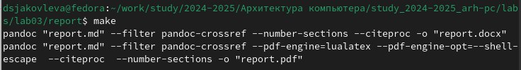

Теперь перейдём в рабочий каталог (Рис. 13):

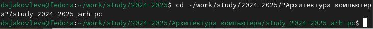

Теперь с помощью git отправим файлы лабораторной работы на Github. В качестве комментария укажем, что мы добавляем файлы для третьей лабораторной работы (Рис. 14):

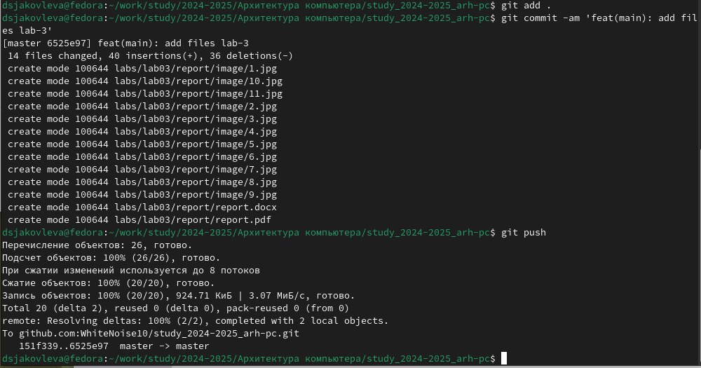

# Выполнение задания для самостоятельной работы

Теперь нам нужно переделать вторую лабораторную работу в формат Markdown. Для этого необходимо для начала перейти в каталог второй лабораторной работы (Рис. 15):

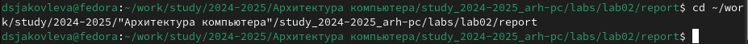

Откроем файл лабораторной работы с помощью gedit (Рис. 16):

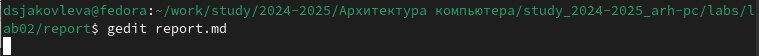

Заполним титульную страницу (Рис. 17):

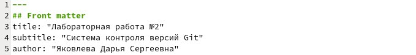

Заполним цель работы и пункт выполнения лабораторной работы (Рис. 18):

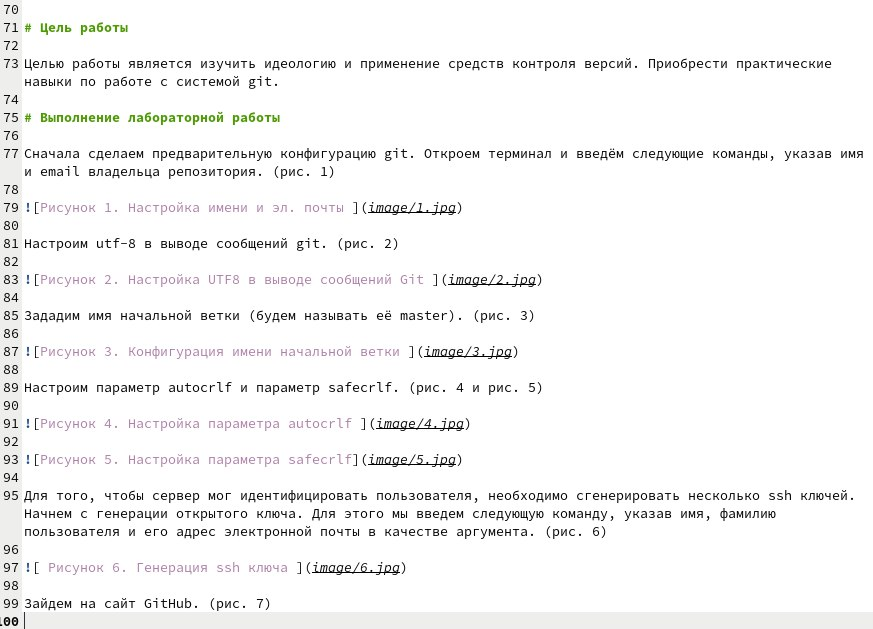

Напишем в отчёте задание для самостоятельной работы (Рис. 19):

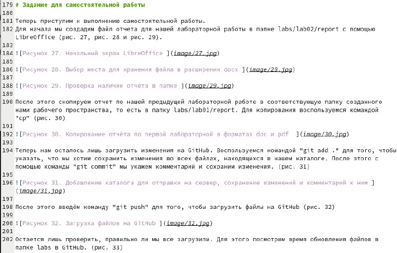

И заполним выводы (Рис. 20):

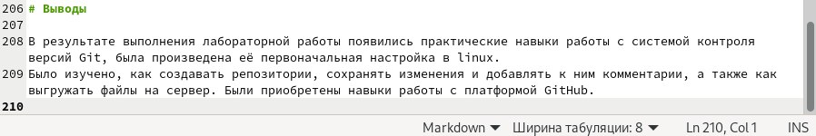

Поместим скриншоты в отдельную папку image (Рис. 21):

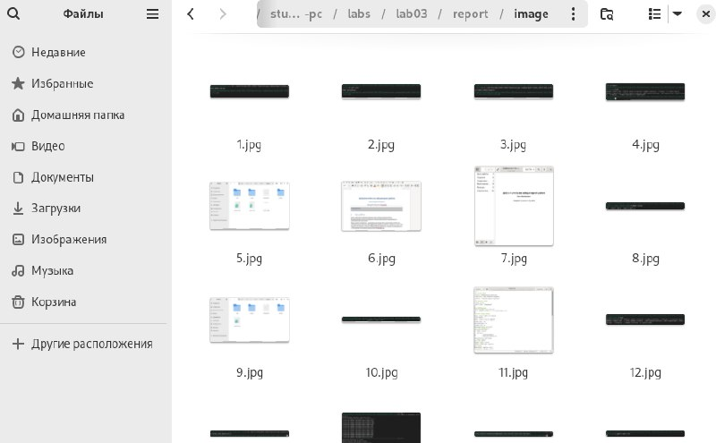

Теперь соберём отчёт с помощью команды make (Рис. 22):

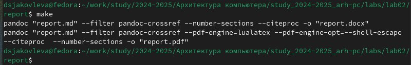

Теперь осталось отправить файлы на Github. Для этого сначала перейдём в рабочий каталог (Рис. 23):

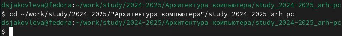

И после этого используем Git Для отправки. В комментарии укажем, что добавляем файлы для лабораторной работы номер 2 (Рис. 24 - 25):

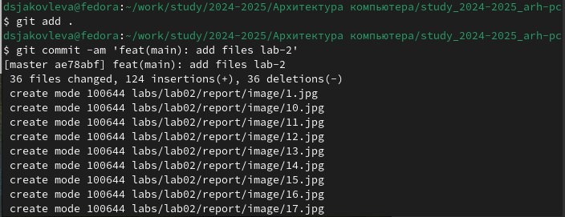

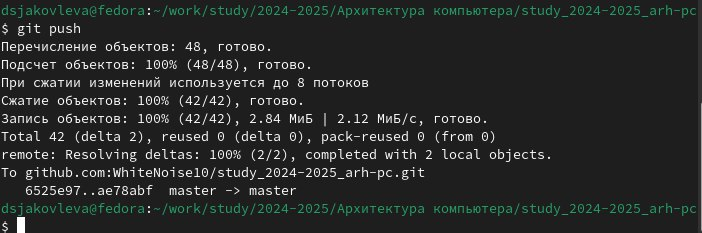

# Выводы

В результате выполнения лабораторной работы были получены навыки работы с языком разметки Markdown, а также были заполнены отчёты для двух лабораторных работ.

